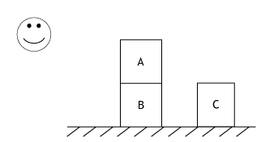
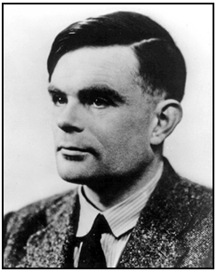

Course Structure:
  1. [Introduction](#module1)
  2. [Computing Machinery and Intelligence (Turing)](#module2)
  3. [Logic](#module3)
  4. [Rules](#module4)
  5. [Concepts](#module5)
  6. [Analogy](#module6)
  7. [Images](#module7)
  8. [Connectionism](#module8)
  9. [Neuroscience](#module9)
  10. [Emotions](#module10)
  11. [Consciousness](#module11)
  12. [Embodiment](#module12)
  13. [Dynamical Systems](#module13)
  14. [Intentionality](#module14)
  15. [Externalism](#module15)
  16. [Conclusion](#module16)

----------

Cue:

- [Lecture 1. Introduction](#1)
  - [Introduction](#1A)
    - [Overview](#1A1)
    - [The Cognitive Paradigm](#1A2)
      - [Intelligence](#1A2a)
      - [Mental Representations and Procedures](#1A2b)
      - [Theory Assessment in Cognitive Science](#1A2c)
      - [Summary](#1A2d)
    - [History of Cognitive Science](#1A3)
      - [Prehistory](#1A3a)
      - [The Cognitive Revolution](#1A3b)
  - [The Syllabus](#1B)
    - [Course Materials](#1B1)
    - [Evaluation](#1B2)
    - [Plagiarism](#1B3)
- [Lecture 2. Computing Machinery and Intelligence (Turing)](#2)
  - [Computing Machinery and Intelligence (Turing)](#2A)
    - [Introduction](#2A1)
    - [Alan Turing](#2A2)
    - [Computing Machinery and Intelligence](#2A3)
    - [Critique of the New Problem](#2A4)
    - [Digital Computer](#2A5)
    - [Universality of Digital Computers](#2A6)
    - [Contrary Views on the Main Question](#2A7)
    - [Issues Raised by the Turing Test](#2A8)
- [Review Questions and References](#2B)
- [Lecture 3. Logic](#3)
- [Lecture 4. Rules](#4)
- [Lecture 5. Concepts](#5)
- [Lecture 6. Analogy](#6)
- [Lecture 7. Images](#7)
- [Lecture 8. Connectionism](#8)
- [Lecture 9. Neuroscience](#9)
- [Lecture 10. Emotions](#10)
- [Lecture 11. Consciousness](#11)
- [Lecture 12. Embodiment](#12)
- [Lecture 13. Dynamical Systems](#13)
- [Lecture 14. Intentionality](#14)
- [Lecture 15. Externalism](#15)
- [Lecture 16. Conclusion](#16)

----------

# Lecture 1. Introduction

## Introduction

### Overview

- Cognitive Science (CogSci): Study of mind and intelligence
- Main concerns:
  - Identify resources used
  - Understand how they are deployed
- Classic view (1950s–1980s):
  - Symbolic representations
  - Symbol processing
- Recent challenges:
  - Adequacy of symbol processing
  - Brain studies
  - Consciousness, emotions
- Aims of the course:
  - Examine classic CogSci as an account of human thinking and intelligence
  - Examine challenges to classic CogSci
- For now:
  - The CogSci paradigm
  - History of CogSci

### The Cognitive Paradigm

- **Paradigm**: a framework for constructing theories
- Cognitive Scientists disagree on the nature of thinking and intelligence
- **Central Thesis**: Thinking is like computation (in a digital computer)
  - Information is represented (data structures)
  - Calculations are performed
- Note: The thesis is an analogy, not a claim of physical resemblance between brains and PCs
- The thesis is a paradigm (Kuhn) more than a theory; it tells researchers …
  1. What to investigate,
  2. What sorts of theories to test, and
  3. How to test and evaluate them.
- For CogSci:
  1. Investigate intelligent behaviours
  2. Theorize about mental representations and procedures
  3. Test using computational models, experiments, etc.

#### Intelligence

Q: What activities require intelligence?
- Typical answers include `recreational challenges`, `argumentation`, `technological work`
- In classic CogSci: intelligence is any activity in which `knowledge` and `expertise` plays a major role
- Intelligence is **knowledge**-intensive

#### Mental Representations and Procedures

- Mental representation - statements:
  - Block A is on block B.
  - Block B is on the ground.
  - Block C is on the ground.
  - Block C is right of block B.
- Mental procedures - rules:
  - To have block x on block y, place block x on top of block y.
  - To place block x on top of block y, remove other blocks from on top of y, pick up block x, move it on block y and let go of block x.
- Make a plan to spell "CAB"

#### Theory Assessment in Cognitive Science

- Theory: `model` or `explanation` of how an intelligent activity occurs
  - Claim about mental representations and procedures, e.g., statements and rules
- Model **confirmed** if performance matches human behaviour (disconfirmed otherwise)
  - This approach is referred as **cognitive modeling** - the operation of the computer program models or imitates the course of human thinking
- CogSci is highly interdisciplinary
  - Different disciplines employ different testing methods, e.g., brain scans in neuroscience

#### Summary

- Central thesis: Thinking is like computing
  - CRUM: Computational-Representational Understanding of Mind
- CRUM is a paradigm rather than a theory
  - Intelligence is knowledge-intensive
  - Produced by mental representations and procedures
  - Theories are testable through simulation, experiment, etc.
- Evaluation of CRUM depends on
  - Record of success or failure of CRUM theories
  - Performance relative to other paradigms
  - Prospects for future success

### History of Cognitive Science

#### Prehistory

- Basic questions:
  1. What do you know and how do you know it? (**epistemology**)
  2. What kind of thing is a mind? (**metaphysics**)
  3. How does a mind give rise to thinking? (**psychology**)
- Some responses:
  - Plato (ca. 400 BC): grasp of ideas, hydraulic analogy
  - Locke (ca. 1700): possession of stattements, blank paper analogy
  - Watson (ca. 1920): S-R arcs, switchboard anaology
  - Weiner (ca. 1940): control configurations, rangefinder analogy

#### The Cognitive Revolution

- 1940s: Turing, electromechanical computers, computer analogy
- 1950s:
  - Miller: short term memory (7&plusmn;2 chunks)
  - Newell & Simon: General Problem Solver
  - Chomsky: syntax as mental representation
- Some general historical trends:
  1. Thinking and intelligence have often been associated with information processing
  2. Information processing technology has often been used as a source of inspiration for theories of cognition

## The Syllabus

### Course Materials

- Textbook
- Reading Materials

### Evaluation

- Refer to "Grade Breakdown"
- Discussion in forum is strongly recommended, but not weighted in grade

### Plagiarism

...

---------

# Computing Machinery and Intelligence (Turing)

## Introduction CRUM

- CRUM
  - Central thesis: thinking is like computing
  - Expertise and knowledge central to intelligence
- _Computing machinery and intelligence_ (Turing 1950)
  - Can machines think? (1953)
  - Drew attention to the topic
  - Laid out the classic paradigm

## Alan Turing

- Cambridge (1936), Princeton (1938)
- Developed general theory of computation
- Instrumental in breaking the Enigma code (WWII)
- Noted that computers can do intelligent work
- Committed suicide in 1954

## Computing Machinery and Intelligence

- The **imitation game**: Why not just use a dictionary definition?
- Subject to **prejudice**:
  - "The question of whether a computer can think is no more interesting than the question of whether a submarine can swim." (Dijkstra)
- Had history been different, our definitions would be different
- Imitation Game
  1. Imitate someone of the opposite gender:
    - (a) man, (b) woman, (c) interrogator
    - Goal: for (c) to distinguish (a) and (b)
    - Teletype interface prevents superficial information from being used by (c)
  2. A computer might imitate a human:
    - (a) computer, (b) person, (c) interrogator
    - Goal: for (c) to distinguish (a) and (b)
    - Teletype interface ensures that only some profound difference, e.g., intelligence, matters

## Critique of the New Problem

- To suppose that a (human) brain is required for intelligence is to **beg the question**
- Why is conversing a good test of intelligence?
  - It provides the computer an opportunity to avoid prejudice, superficial judgement
  - We often judge a person’s intelligence through conversation
  - We would still need to avoid jumping to conclusions though

## Digital Computer

- Among machines, the digital computer holds most interest
- Components of a typical digital computer:
  1. Memory (RAM)
  2. Executive unit (CPU)
  3. Control (program)
- A program is a series of numbers interpreted as instructions by the executive
  - "If position 4505 contains 0 obey next the instruction stored in 6707, otherwise continue straight on"
- Carrying out instructions determines the computer’s behaviour

## Universality of Digital Computers

- Two kinds of digital computers:
  1. Special purpose (e.g., a chess computer)
  2. General purpose (e.g., a PC)
- A general purpose computer can imitate the activity of any other computer
- If a general purpose computer succeeds at the imitation game, it would be due to its program, not its physical hardware
- Intelligence is highly abstract in nature

## Contrary Views on the Main Question

- Original prediction: success in 50 years
  - Later, 100 years
- Current activity: Loebner prize
  - Success is not yet in sight
- Is success out of the question?
- Objections include:  Theological, mathematical, consciousness, originality, etc.
  - Theological objection:
    - Argument: thinking requires a soul, computers have no souls, so computers cannot think
    - Reply: it only follows that computers do not think
      - Being omnipotent, God could give souls to computers, enabling them to think
    - Ultimately, whether computers can think is an empirical matter, determined by empirical tests (e.g., the imitation game)
      - Biblical arguments about empirical matters is unreliable
  - Mathematical objection:
    - Some questions are answerable by humans and not by digital computers:
      - Gödel’s theorem shows that there are questions of logic not answerable, in principle, by a given computer
      - The person framing the question can determine the answer
    - Reply: there may be such questions for any given human
      - Perhaps a computer could scan your brain and frame a question unanswerable by you, in principle
      - The computer could computer the answer though
    - The Gödel argument **begs the question**
  - Consciousness objection:
    - We can know that something thinks only if we know that it has conscious experiences
      - It is like something to be intelligent
    - Reply: We know of our own conscious experiences only
      - Solipsism: only I am known to be conscious
    - To avoid absurdity, we must admit behavioural evidence for intelligence
      - E.g., the imitation game
  - Originality objection:
    - Lady Lovelace noted that Babbage’s Analytical engine had no pretense to originality
      - Perhaps it lacked enough capacity
    - A digital computer simply obeys its instructions and so does nothing original, unlike intelligent humans
    - Reply:
      1. The objection begs the question: Perhaps the same is true of humans
      2. “Machines take me by surprise with great frequency”. But they are predictable in principle? See point 1.

## Issues Raised by the Turing Test

- Turing deemphasizes physical constitution and emphasizes possession of knowledge
  - Is hardware truly beside the point?
  - Perhaps intelligence requires a brain
- The imitation game is indifferent to experience and learning
  - Could a “brain in a vat” be intelligent?
  - Perhaps intelligence requires a body

# Review Questions and References
