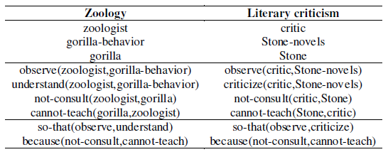

Course Structure:

1. [Introduction](#module1)
2. [Computing Machinery and Intelligence (Turing)](#module2)
3. [Logic](#module3)
4. [Rules](#module4)
5. [Concepts](#module5)
6. [Analogy](#module6)
7. [Images](#module7)
8. [Connectionism](#module8)
9. [Neuroscience](#module9)
10. [Emotions](#module10)
11. [Consciousness](#module11)
12. [Embodiment](#module12)
13. [Dynamical Systems](#module13)
14. [Intentionality](#module14)
15. [Externalism](#module15)
16. [Conclusion](#module16)

----------

Cue:

- [Lecture 1. Introduction](#1)
    - [Introduction](#1A)
        - [Overview](#1A1)
        - [The Cognitive Paradigm](#1A2)
            - [Intelligence](#1A2a)
            - [Mental Representations and Procedures](#1A2b)
            - [Theory Assessment in Cognitive Science](#1A2c)
            - [Summary](#1A2d)
        - [History of Cognitive Science](#1A3)
            - [Prehistory](#1A3a)
            - [The Cognitive Revolution](#1A3b)
    - [The Syllabus](#1B)
        - [Course Materials](#1B1)
        - [Evaluation](#1B2)
        - [Plagiarism](#1B3)
- [Lecture 2. Computing Machinery and Intelligence (Turing)](#2)
    - [Computing Machinery and Intelligence (Turing)](#2A)
        - [Introduction](#2A1)
        - [Alan Turing](#2A2)
        - [Computing Machinery and Intelligence](#2A3)
        - [Critique of the New Problem](#2A4)
        - [Digital Computer](#2A5)
        - [Universality of Digital Computers](#2A6)
        - [Contrary Views on the Main Question](#2A7)
        - [Issues Raised by the Turing Test](#2A8)
    - [Review Questions and References](#2B)
- [Lecture 3. Logic](#3)
    - [Logic](#3A)
        - [Overview](#3A1)
        - [Arguments](#3A2)
        - [Propositional Logic](#3A3)
            - [Propositional Symbolization](#3A3a)
            - [Propositional Arguments](#3A3b)
        - [Predicate Logic](#3A4)
            - [Predicate Symbolization](#3A4a)
            - [Predicate Arguments](#3A4b)
        - [Probabilistic Logic](#3A5)
            - [Probabilistic Symbolization](#3A5a)
            - [Probabilistic Arguments](#3A5b)
    - [Evaluation of Logic](#3B)
        - [Overview](#3B1)
        - [Representational Power](#3B2)
        - [Computational Power](#3B3)
            - [Planning](#3B3a)
            - [Decision](#3B3b)
            - [Explanation](#3B3c)
            - [Learning](#3B3d)
            - [Psychological Plausibility](#3B3e)
            - [Summary](#3B3f)
- [Lecture 4. Rules](#4)
    - [Rules](#4A)
        - [Overview](#4A1)
        - [History of Rules](#4A2)
        - [Rules-Based Systems](#4A3)
        - [Search](#4A4)
            - [Knowledge Space](#4A4a)
            - [Search Strategies](#4A4b)
            - [Heuristics](#4A4c)
            - [Which Strategy to Use](#4A4d)
    - [Evaluation of Rules](#4B)
        - [Overview](#4B1)
        - [Representational Power](#4B2)
        - [Computational Power](#4B3)
            - [Explanation](#4B3a)
            - [Learning](#4B3b)
            - [Language](#4B3c)
        - [Computational Limitations](#4B4)
        - [Psychological Plausibility](#4B5)
        - [Philosophical Issues](#4B6)
- [Lecture 5. Concepts](#5)
    - [Concepts](#5A)
        - [Overview](#5A1)
        - [History of Concepts](#5A2)
        - [Theories of Concepts](#5A3)
            - [Definitions](#5A3a)
            - [Prototypes](#5A3b)
            - [Exemplars](#5A3c)
            - [Causal](#5A3d)
        - [Tomato - Fruit or Vegetable?](#5A4)
    - [Evaluation of Concepts](#5B)
        - [Overview](#5B1)
        - [Representational Power](#5B2)
        - [Computational Power](#5B3)
            - [Inheritance](#5B3a)
            - [Matching](#5B3b)
        - [Psychological Plausibility](#5B4)
            - [Planning](#5B4a)
            - [Explanation](#5B4b)
            - [Learning](#5B4c)
- [Lecture 6. Analogy](#6)
    - [Analogy](#6A)
        - [Overview](#6A1)
        - [Analogy as Induction Generalization](#6A2)
        - [Analogy as Extrapolation](#6A3)
        - [The Multiconstraint Theory](#6A4)
            - [Representation](#6A4a)
            - [Constraints on Coherence](#6A4b)
    - [Evaluation of Analogy](#6B)
        - [Overview](#6B1)
        - [Representational Power](#6B2)
            - [Verbal](#6B2a)
            - [Visual](#6B2b)
            - [Emotional](#6B2c)
        - [Computational Power](#6B3)
            - [Analogy Construction](#6B3a)
            - [Explanation](#6B3b)
            - [Learning](#6B3c)
            - [Metaphor](#6B3d)
        - [Limits of Analogical Reasoning](#6B5)
- [Lecture 7. Images](#7)
    - [Images](#7A)
        - [Overview](#7A1)
        - [The Imagery Debate](#7A2)
        - [Quasi-Pictorialism](#7A3)
        - [Experimental Evidence for Quasi-Pictorialism](#7A4)
            - [Mental Rotation](#7A4a)
            - [Scanning](#7A4b)
            - [Zooming and Inspection](#7A4c)
            - [Demand Characteristics?](#7A4d)
        - [Neurological Evidence for Quasi-Pictorialism](#7A5)
            - [In Search of the Visual Buffer](#7A5a)
            - [Interference](#7A5b)
    - [Evaluation of Images](#7B)
        - [Overview](#7B1)
        - [Descriptionism](#7B2)
            - [Infinite Regress](#7B2a)
            - [Hedging](#7B2b)
            - [Absent Features](#7B2c)
            - [Imagery in Interpreted](#7B2d)
            - [Computational Equivalence](#7B2e)
        - [Representational Power](#7B3)
            - [Deep](#7B3a)
            - [Spatial](#7B3b)
            - [Visual](#7B3c)
            - [Limitations](#7B3d)
        - [Computational Power](#7B4)
            - [Scientific Discovery](#7B4a)
            - [Technical Innovation](#7B4b)
            - [Analogy](#7B4c)
- [Lecture 8. Connectionism](#8)
- [Lecture 9. Neuroscience](#9)
- [Lecture 10. Emotions](#10)
- [Lecture 11. Consciousness](#11)
- [Lecture 12. Embodiment](#12)
- [Lecture 13. Dynamical Systems](#13)
- [Lecture 14. Intentionality](#14)
- [Lecture 15. Externalism](#15)
- [Lecture 16. Conclusion](#16)

----------

# Lecture 1. Introduction

## Introduction

### Overview

- Cognitive Science (CogSci): Study of mind and intelligence
- Main concerns:
    - Identify resources used
    - Understand how they are deployed
- Classic view (1950s–1980s):
    - Symbolic representations
    - Symbol processing
- Recent challenges:
    - Adequacy of symbol processing
    - Brain studies
    - Consciousness, emotions
- Aims of the course:
    - Examine classic CogSci as an account of human thinking and intelligence
    - Examine challenges to classic CogSci
- For now:
    - The CogSci paradigm
    - History of CogSci

### The Cognitive Paradigm

- **Paradigm**: a framework for constructing theories
- Cognitive Scientists disagree on the nature of thinking and intelligence
- **Central Thesis**: Thinking is like computation (in a digital computer)
    - Information is represented (data structures)
    - Calculations are performed
- Note: The thesis is an analogy, not a claim of physical resemblance between brains and PCs
- The thesis is a paradigm (Kuhn) more than a theory; it tells researchers …
    1. What to investigate,
    2. What sorts of theories to test, and
    3. How to test and evaluate them.
- For CogSci:
    1. Investigate intelligent behaviours
    2. Theorize about mental representations and procedures
    3. Test using computational models, experiments, etc.

#### Intelligence

Q: What activities require intelligence?
- Typical answers include `recreational challenges`, `argumentation`, `technological work`
- In classic CogSci: intelligence is any activity in which `knowledge` and `expertise` plays a major role
- Intelligence is **knowledge**-intensive

#### Mental Representations and Procedures

- Mental representation - statements:
    - Block A is on block B.
    - Block B is on the ground.
    - Block C is on the ground.
    - Block C is right of block B.
- Mental procedures - rules:
    - To have block x on block y, place block x on top of block y.
    - To place block x on top of block y, remove other blocks from on top of y, pick up block x, move it on block y and let go of block x.
- Make a plan to spell "CAB"

#### Theory Assessment in Cognitive Science

- Theory: `model` or `explanation` of how an intelligent activity occurs
    - Claim about mental representations and procedures, e.g., statements and rules
- Model **confirmed** if performance matches human behaviour (disconfirmed otherwise)
    - This approach is referred as **cognitive modeling** - the operation of the computer program models or imitates the course of human thinking
- CogSci is highly interdisciplinary
    - Different disciplines employ different testing methods, e.g., brain scans in neuroscience

#### Summary

- Central thesis: Thinking is like computing
    - CRUM: Computational-Representational Understanding of Mind
- CRUM is a paradigm rather than a theory
    - Intelligence is knowledge-intensive
    - Produced by mental representations and procedures
    - Theories are testable through simulation, experiment, etc.
- Evaluation of CRUM depends on
    - Record of success or failure of CRUM theories
    - Performance relative to other paradigms
    - Prospects for future success

### History of Cognitive Science

#### Prehistory

- Basic questions:
    1. What do you know and how do you know it? (**epistemology**)
    2. What kind of thing is a mind? (**metaphysics**)
    3. How does a mind give rise to thinking? (**psychology**)
- Some responses:
    - Plato (ca. 400 BC): grasp of ideas, hydraulic analogy
    - Locke (ca. 1700): possession of stattements, blank paper analogy
    - Watson (ca. 1920): S-R arcs, switchboard anaology
    - Weiner (ca. 1940): control configurations, rangefinder analogy

#### The Cognitive Revolution

- 1940s: Turing, electromechanical computers, computer analogy
- 1950s:
    - Miller: short term memory (7&plusmn;2 chunks)
    - Newell & Simon: General Problem Solver
    - Chomsky: syntax as mental representation
- Some general historical trends:
    1. Thinking and intelligence have often been associated with information processing
    2. Information processing technology has often been used as a source of inspiration for theories of cognition

## The Syllabus

### Course Materials

- Textbook
- Reading Materials

### Evaluation

- Refer to "Grade Breakdown"
- Discussion in forum is strongly recommended, but not weighted in grade

### Plagiarism

...

---------

# Computing Machinery and Intelligence (Turing)

## Introduction CRUM

- CRUM
    - Central thesis: thinking is like computing
    - Expertise and knowledge central to intelligence
- _Computing machinery and intelligence_ (Turing 1950)
    - Can machines think? (1953)
    - Drew attention to the topic
    - Laid out the classic paradigm

## Alan Turing

- Cambridge (1936), Princeton (1938)
- Developed general theory of computation
- Instrumental in breaking the Enigma code (WWII)
- Noted that computers can do intelligent work
- Committed suicide in 1954

## Computing Machinery and Intelligence

- The **imitation game**: Why not just use a dictionary definition?
- Subject to **prejudice**:
    - "The question of whether a computer can think is no more interesting than the question of whether a submarine can swim." (Dijkstra)
- Had history been different, our definitions would be different
- Imitation Game
    1. Imitate someone of the opposite gender:
        - (a) man, (b) woman, (c) interrogator
        - Goal: for (c) to distinguish (a) and (b)
        - Teletype interface prevents superficial information from being used by (c)
    2. A computer might imitate a human:
        - (a) computer, (b) person, (c) interrogator
        - Goal: for (c) to distinguish (a) and (b)
        - Teletype interface ensures that only some profound difference, e.g., intelligence, matters

## Critique of the New Problem

- To suppose that a (human) brain is required for intelligence is to **beg the question**
- Why is conversing a good test of intelligence?
    - It provides the computer an opportunity to avoid prejudice, superficial judgement
    - We often judge a person's intelligence through conversation
    - We would still need to avoid jumping to conclusions though

## Digital Computer

- Among machines, the digital computer holds most interest
- Components of a typical digital computer:
    1. Memory (RAM)
    2. Executive unit (CPU)
    3. Control (program)
- A program is a series of numbers interpreted as instructions by the executive
    - "If position 4505 contains 0 obey next the instruction stored in 6707, otherwise continue straight on"
- Carrying out instructions determines the computer's behaviour

## Universality of Digital Computers

- Two kinds of digital computers:
    1. Special purpose (e.g., a chess computer)
    2. General purpose (e.g., a PC)
- A general purpose computer can imitate the activity of any other computer
- If a general purpose computer succeeds at the imitation game, it would be due to its program, not its physical hardware
- Intelligence is highly abstract in nature

## Contrary Views on the Main Question

- Original prediction: success in 50 years
    - Later, 100 years
- Current activity: Loebner prize
    - Success is not yet in sight
- Is success out of the question?
- Objections include:  Theological, mathematical, consciousness, originality, etc.
    - Theological objection:
        - Argument: thinking requires a soul, computers have no souls, so computers cannot think
        - Reply: it only follows that computers do not think
            - Being omnipotent, God could give souls to computers, enabling them to think
        - Ultimately, whether computers can think is an empirical matter, determined by empirical tests (e.g., the imitation game)
            - Biblical arguments about empirical matters is unreliable
    - Mathematical objection:
        - Some questions are answerable by humans and not by digital computers:
            - G&ouml;del's theorem shows that there are questions of logic not answerable, in principle, by a given computer
            - The person framing the question can determine the answer
        - Reply: there may be such questions for any given human
            - Perhaps a computer could scan your brain and frame a question unanswerable by you, in principle
            - The computer could computer the answer though
        - The G&ouml;del argument **begs the question**
    - Consciousness objection:
        - We can know that something thinks only if we know that it has conscious experiences
            - It is like something to be intelligent
        - Reply: We know of our own conscious experiences only
            - Solipsism: only I am known to be conscious
        - To avoid absurdity, we must admit behavioural evidence for intelligence
            - E.g., the imitation game
    - Originality objection:
        - Lady Lovelace noted that Babbage's Analytical engine had no pretense to originality
            - Perhaps it lacked enough capacity
        - A digital computer simply obeys its instructions and so does nothing original, unlike intelligent humans
        - Reply:
            1. The objection begs the question: Perhaps the same is true of humans
            2. "Machines take me by surprise with great frequency". But they are predictable in principle? See point 1.

## Issues Raised by the Turing Test

- Turing deemphasizes physical constitution and emphasizes possession of knowledge
    - Is hardware truly beside the point?
    - Perhaps intelligence requires a brain
- The imitation game is indifferent to experience and learning
    - Could a "brain in a vat" be intelligent?
    - Perhaps intelligence requires a body

# Review Questions and References

----------

# Lecture 3. Logic

## Logic

### Overview

- **Logic**: the study of arguments 
    - Assess their strength 
    - Represent their content and form 
- Example: Does the Bear Patrol work? 
    - Homer: Not a bear in sight. The Bear Patrol must be working like a charm. 
    - Lisa: That's specious reasoning, Dad. 
    - Homer: Thank you, dear. 
    - Lisa: By your logic I could claim that this rock keeps tigers away. 
- What problems are there with Homer's argument? 
- The strength of the argument rests on its form and the reasons given 
- Introduction to modern symbolic logic
    - Propositional logic 
    - Predicate logic 
    - Probability 
- Is formal logic a model for mental representations and procedures? 

### Arguments

- Argument Form
    - Aristotle (385-322 BC) found that form affects argument assessment 
        - **formal** logic 
    - Homer's argument: 
        - [There is a gear Patron]
        - Not a bear in sight
        - -->
        - Therefore, the Boar Patrol keeps bears away
    - Premises, underline, conclusion 
- Argument validity 
    - Syllogism: 2 premises 
        - All geese are birds. 
        - All birds have Wings. 
        - -->
        - All geese have Wings. 
    - This argument is **valid**. If the premises are true, then the conclusion is true also 
        - All lions are cats. 
        - All cats have fur. 
        - -->
        - All lions have fur.
    - and:
        - All lions are waffles
        - All waffles are birds. 
        - -->
        - All lions are birds. 
    - Not all argument forms are valid: 
        - There is a Bear Patrol 
        - Not a bear in sight 
        - -->
        - The Bear patrol keeps bears away 
    - Likewise: 
        - There is an anti-tiger rock. 
        - Not a tiger in sight, 
        - -->
        - The anti-tiger rock keeps tigers away. 
    - Any argument of this form is non-valid 

### Propositional Logic

- Problem: not a I valid arguments are syllogisms 
- Boole (1815-1864): Treat logic like algebra 
    - If Socrates is a man, then he is mortal. 
    - Socrates is a man. 
    - -->
    - Socrates is mortal. 
- Becomes 
    - S &sup; M [S = "Socrates is a man"]
    - S [M = "Socrates is mortal"]
    - -->
    - M
- The first premise is a pair of sentences (S, M) connected by "&sup;"

#### Propositional Symbolization

- Simple sentences are single letters, e.g., 
    1. "Jill likes movies" [M], and 
    2. "Jill likes starry skies" [S] 
- Complex sentences are single letters combined by connectives, e.g., 
    1. **Conjunction**: "Jill likes movies and starry skies" [M &amp; S] 
    2. **Disjunction**: -Jill ikes movies or starry skies" [M &or; S]. 
    3. **Implication**: "If Jill likes movies, then Jill likes starry skies" [M &sup; S]
    4. **Negation**: "Jill does not like movies" [~M]
- More examples:
    - The rent is due and I have no money. [R &amp; ~M]
    - London and Paris are national capitals. [L &amp; P]
    - Tme is not on my side. [~T]
    - The campers were tired, but they were happy. [T &amp; H]
    - I will go hiking if I finish my work first. [F &sup; H]
    - If nominated I will not run, and if elected I will not serve. [(N &sup; ~R) &amp; (E &sup; ~S)]
- Exercise: symbolize the following using the symbols given 
    1. A conjunction has two components while a negation has only one. [C, N] 
    2. If we attempt this pay then we'l either win big or lose big. [A, W, L] 
    3. I will leave town unless you call me. [L, C] 
    4. Skip class again and you won't pass the course. [S, P]

#### Propositional Arguments

- Symbolization exposes form and validity: 
    - If the gear Patrol works, then no bears are in Sight.
    - The Bear Patrol works.
    - --> 
    - No bears in Sight. 
- To the symbol, it will be:
    - W &sup; ~B
    - W
    - -->
    - ~B
- An argument Of this form is called **modus ponens** and is always valid: 
    - p &sup; q
    - p
    - -->
    - q
- Not every form of argument is valid, e.g., 
    - If the gear Patrol works, then no bears are in Sight.
    - No bears in Sight. 
    - --> 
    - The Bear Patrol works.
- To the symbol, it will be:
    - W &sup; ~B
    - ~B
    - -->
    - W
- This form is a **fallacy**: _affirming the consequent_. It is always non-valid: 
    - p &sup; q
    - q
    - -->
    - p

### Predicate Logic

- Many arguments valid in English are not valid in propositional logic, e.g., 
    - A geese are birds. 
    - All birds have winqs. 
    - -->
    - A geese have Wings. 
- or, symbolicly:
    - B
    - W
    - -->
    - G
- Propositional logic does not symbolize content shared among statements 
- Pred cate logic addresses this deficiency 

#### Predicate Symbolization

- Sentences are broken down into predicates and 
terms, e.g., 
    1. "Bill has a great smile." 
    2. "Jill is witty and intelligent." 
    3. "Tina is taller than Jill." 
- Becomes 
    1. Sb [Sx: x has a great smile; b = Bill]
    2. Wj &amp; Ij  [Wx: x is witty; Ix: x is intelligent; j = Jill]
    3. Stj [Txy: x is taller than y; t = Tina]
- Quantifiers 
    - Quantifiers symbolize English quantity adverbs: 
        1. The universal quantifier (&forall;): The sentence applies to every individual 
        2. The existential quantifier (&exist;): The sentence applies to at least some individual.
- For example: 
    - "Some people just do not listen. [(&exist;x)(Px &amp; ~Lx)]"
    - "All is well that ends well. [(&forall;x)(Ex &sup; Wx)]"
    - "Nobody likes a smartass. [~(&exist;x)(Px &amp; (&forall;y)(Sy &sup; Lxy)]"
- Exercise 
    - Symbolize the following using the symbols given 
        - Some people can't be bought (P, B). 
        - A penny saved is a penny earned (P, S, E) 
        - Every dog has day (D, D', H). 

#### Predicate Arguments

- A valid predicate argument: 
    - A geese are birds. [(&forall;x)(Gx &sup; Bx)]
    - A birds have wings. [(&forall;x)(Bx &sup; Wx)]
    - -->
    - A geese have wings. [(&forall;x)(Gx &sup; Wx)]
- Another valid argument (different form): 
    - All men are mortal. [(&forall;x)(Mx &sup; M'x)]
    - Socrates is a man. [Ms]
    - Socrates is mortal. [M's]

### Probabilistic Logic

- We need to assess non-valid arguments too 
    - E.g., weather forecasts 
- Apply domain-specific knowledge 
- Probabilities can represent such knowledge 
    - E.g., the probability of rain is 40% 
- Extend propositional logic for this purpose 

#### Probabilistic Symbolization

- Probability of proposition _p_: pr(p) = [0...1]
    1. pr(_p_) = 0 if _p_ is certainly false and 
    2. pr(_p_) = 1 if _p_ is certainly true. 
- Examples: 
    - _p_ = "It Will snow in January." pr(_p_) = .99 
    - _p_ = "It Will snow in April." pr(_p_) = .65 
    - _p_ = "It will snow in August." pr(_p_) = .02 
- Probability rules 
    - Rules for probabi ities of complex sentences: 
        1. pr(~_p_) = 1 - pr(_p_)
        2. pr(_p_&or;_q_) = pr(_p_) + pr(_q_)
        3. pr(_p_&amp;_q_) = pr(_p_) &bull; pr(_q_)
        4. pr(_p_|_q_) = pr(_p_&amp;_q_) / pr(_q_)
    - Examples: 
        - pr("no snow in January") = 1 - pr("snow in January") = 1 - .99 = .01
        - pr("1 or 2 on a die roll") = pr("1 on a die roll") + pr("2 on a die roll") = 1/6 + 1/6 = 1/3
        - pr("snow in January and April") = pr("snow in January") &bull; pr("snow in April") = .99 &bull; .65 = .6435
        - pr("someone is an artsie given that she's female") = ??

#### Probabilistic Arguments

- An argument is convincing if 
    - pr(_c_|_r_) >> pr(~_c_|_r_)
    - _r_ = reason, _c_ = conclusion 
- Example: 
    - Verv often. it has snowed in January. 
    - -->
    - Probably, it WI I snow next January. 
- Symbolicly:
    - J
    - -->
    - N
- Calculations: 
    - pr(N|J) = pr(N &amp; J)/pr(J) = (.9 &bull; .99)/.99 = .9
    - pr(~N|J) = pr(~N &amp; J)/pr(J) = (.1 &bull; .99)/.99 = .1
- The argument is a strong one, probabilistically 
- A weak argument? 
    - Not a bear in sight. 
    - -->
    - The Bear Patrol works. 
- Symbolicly:
    - ~B
    - -->
    - W
- Calculations: 
    - pr(W|~B) = pr(W &amp; ~B)/pr(~B) = (.5 &bull; .99)/.99 = .5
    - pr(~W|~B) = pr(~W &amp; ~B)/pr(~B) = (.5 &bull; .99)/.99 = .5
- The argument is weak 
    - Assuming pr(W) = pr(~W) 

## Evaluation of Logic

### Overview

- Formal logic provides for the symbolization  and evaluation of arguments 
- Does logic capture **laws of thought**? 
    - Aristotle and Boole agreed, Frege d'd not 
- Why did the pioneers of CogSci look to formal logic? 
    -  Powerful and rigourous 
    -  Amenable to computational modeling 
    -  Logical thinking is a hallmark of intelligence 

### Representational Power

- Propositional logic captures some valid arguments, e.g., (_modus ponens_) 
    - If it rains, then the sidewalk gets Wet.
    - It is raining. 
    - -->
    - The sidewalk is wet. 
- or symbolicly:
    - R &sup; W
    - R
    - -->
    - W
- Predicate logic captures more valid arguments, e.g., 
    - All men are mortal. [(&forall;x)(Mx &sup; M'x)]
    - Socrates is a man. [Ms]
    - Socrates is mortal. [M's]
- Sentences 
    - To symbolize arguments, formal logic focuses on statements 
    - There are other kinds of sentences, e.g., 
        - **Questions**: "How do I get to the Bookstore from here?" 
        - **Orders**: "Set your phasers to kill!" 
        - **Requests**: "Would you pass the salt, please?" 
- Texts 
    - Not all texts are arguments, e.g., 
> I'm sorry but this reading initiative. I'm sorry, I've never been a fan of books. I don't trust them. They're all fact, no heart. I mean, they're elitist, telling us what is or isn't true, or what did or didn't happen. Who's Britannica to tell me the Panama Cana was built in 1914? If I want to say it was built in 1941, that's my right as an American! I'm with the prescient, let history decide what did or did not happen." 
- Representational limitations 
    - Predicate logic is specialized where natural languages are generalized 
    - Doesn't the generalized nature Of language reflect the generalized nature of thinking, and so mental representations? 
    - Formal logic has been extended to address other kinds of sentences 
        - The extensions are complex and unwieldy in combination 

### Computational Power

- Argument construction is a model of intelligent thinking 
- E.g., when Homer said 
> "Not a bear in sight. The Bear patrol must like a charm," 
- was he thinking...?
    - There is a Bear patrol 
    - Not a bear in Sight 
    - -->
    - The Bear Patrol keeps bears away 
- Perhaps thinking is applying rules to symbols, e.g.
    - p &sup; q
    - p
    - -->
    - q

#### Planning

- **Planning**: represent goals and steps to achieve them 
- E.g., Go from Guelph to UW: 
    1. travel(I, Hwy-7) --> reach(I, Hwy-85)
    2. reach(I, Hwy-85) --> travel(I, Hwy-85)
    3. travel(I, Hwy-85) --> reach(I, University-Ave)
    4. reach(I, University-Ave) --> travel(I, University-Ave)
    4. travel(I, University-Ave) --> reach(I, UW)
- Note the change in notation favoured by Cognitive Scientists 
- A route could be **deduced** from these rules 
- Pro: if a route exists, deduction will determine it 
- Cons: Many valid inferences are not helpful: 
    - p ["Conjunction"]
    - q
    - -->
    - P &amp; q
- If I travel Hwy-7 and Hwy-85, I could deduce:
    - travel(I, Hwy-7) &amp; travel(I, Hwy-85)
    - travel(I, Hwy-7) &amp; travel(I, Hwy-85) &amp; travel(I, Hwy-7)
- The relevance of an inference s unconnected with its validity 
- Deduction is **monotonic**
- Planning must often be norrmonotonic 
    - E.g., a route s blocked 
        - monotonic
        - non-monotonic 

#### Decision

- **Decision**: choosing among plans 
- Deduction only determines _if_ plans exist 
    - Preferences need to be added, e.g., travel(I, Hwy-7) --> reach(I, Hwy-85) &amp; preferto(I, Hwy-7, Hwy-401)
- Assumptions of this approach: 
    1. I can completely order my preferences, and 
    2. I can know all my preferences before I make my plans. 
- Perhaps probabilities could address these assumptions 
    - E.g., decide among English, German, Philosophy courses 
is is English") 
    - pr("C is interesting" | "C is english")
- This solut'on is computationally explosive 
    - pr(A|B) must be known for every A and B 
    - For n predicates, there 2n-1 conditional probabilities 

#### Explanation

- Why doesn't my favorite Website load? 
    1. Your browser has a bug; 
    2. Your connection s not working properly; 
    3. Your server at your service provider is not working; 
    4. The Website server is not working; 
    5. The URL is incorrect. 
- Some deductions are explanations (Hempel) 
    - ~respond(Website) --> incorrect(URL) 
    - ~respond(Website)
    - -->
    - incorrect(URL)
- Problems: 
    - Multiple explanations? 
    - Some deductions are not explanations, e.g., the height of a flagpole 
- How do you explain the height of a flagpole? 
    - Some explanations are **abductions** (Peirce) 
        - down(Website-server) --> ~readable(Website) 
        - -readable(Website) 
        - -->
        - down(Website-server) 
- Problems: 
    - Such inductions are risky 
    - Use conditional probability to determine the best **explanation**, e.g., pr("Website server is down"|"Website is not readable") = 0.4 

#### Learning

- Abduction is a form Of learning 
- Inductive generalization also, e.g., 
    - Philosophy(Phil-128) &amp; interesting(Phil-128) 
    - Philosophy(Phil-256) &amp; interesting(Phil-256) 
    - -->
    - (&forall;x)(Philosophy(x) --> interesting(x)) 
- Problem: risk jumping to conclusions 
- Do you reason in this way? When? 

#### Psychological Plausibility

- Subjects agree that modus ponens is deductive, but not affirming the _consequent_: 
    - If the Bear Patrol works, then no bears are in sight 
    - No bears are in sight 
    - -->
    - Therefore, the Bear Patrol works 
- Do people think deductively? 
- Wason card task: 
    - given four cards from a deck with numbers on one side & letters on the other: [A] [B] [2] [3]. 
    - Flip which cards to test the rule: If a card has an A on one side, then it has an even number on the Other side 
- Most subjects select [A] and [2]; many omit [3] 
- Explanations: 
    - People are not logical, do not apply **modus tollens**: 
        - p &sup; q
        - ~q
        - -->
        - ~p
    - People employ schemata 
    - People employ mental models: represent [A] and even-number; assume only represented items are relevant
- People do not seem to think in accord with the axioms of probability, e.g., 
    - pr(a) &bull; pr(b) < pr(b) 
- Suppose Frank likes to read French literature, attend foreign films, and discuss world politics 
- People often judge that 
    - pr("college-educated") &bull; pr("carpenter") > pr("carpenter") 
- Instead of probability, people employ stereotypes 

#### Summary

----------

# Lecture 4. Rules

## Rules

### Overview

- Rule: an IF... THEN... structure modeled on implication (&sup;), e.g. 
    - IF a king is in check AND no move can remove it from check THEN the checking player wins. 
- Basic idea:
    - Preserve the representational power of logic 
    - Extend and generalize it as needed 
- Adaptations include: 
    - Different **meaning** for IF... THEN... structures 
    - Define and apply **search strategies** for rule use 

### History of Rules

- Logic Theorist (LT) developed by Newell & Simon (1950s) 
    - Imitate theorem-proving methods of students 
    - Used **backward chaining** and **subgoaling**
- Generalized Problem Solver (GPS) developed in the 1960s 
    - Solve any sort of problem 
    - Used **means-ends analysis** and **difference lists**
- Limitations of GPS include: 
    - Certain problems, e.g., chess, were beyond its capabilities 
    - Could not learn from experience 
- Modern systems address limitations of GPS, e.g., 
    - ACT-R (Anderson) 
    - SOAR (Newell, Laird, Rosenbloom) 
- Expert systems, e.g., MYCIN, also 

### Rules-Based Systems

- Three components: 
    1. representation of **goal** and **initial condition**, 
    2. a database ot **rules**, and 
    3. a **strategy** or algorithm for applying the rules 
- Initial condition of Towers ot Hanoi problem: 
    - Peg 1 contains a, b, and c trom top to bottom 
    - Peg 2 is empty 
    - peg 3 is empty 
    - Disc a < disc b, disc b < disc c 
- Goal: peg 3 contains discs a, b, and c from top to bottom 
- Knowledge 
    - The rule database represents the knowledge of the system, e.g., the _Towers of Hanoi problem_.
        1. IF disc _x_ is on top of peg _i_ and peg _j_ is empty THEN move disc _x_ on top of peg _j_
        2. IF disc _x_ is on top of peg _i_ and disc _y_ is on of peg _j_ and _x_ < _y_ THEN move disc _x_ on top of peg _j_
    - Perhaps one rue would do, e.g., 
        3. IF peg 1 contains discs a, b and c from top to bottom THEN move a to 3, b to 2, a to 2, c to 3, a to 1, b to 2, a to 3 
    - Often, we are not so fortunate 
    - Rules may be **combined** to arrive at a plan 
        1. IF disc a is on top of peg 1 and 3 is empty THEN move a to 3 
        2. IF disc a is on top of peg 1 and 2 is empty THEN move b to 2 
        3. IF disc a is on top of peg 3 and disc b is on top of peg 2 and a < b THEN move a to 2
        4. IF disc c is on top of peg 1 and 3 is empty THEN move c to 3 
        5. IF disc b is on top of peg 2 and 1 is empty THEN move a to 1 
        6. IF disc b is on top of peg 2 and disc c is on top of peg 3 and b < c THEN move a to 3
        7. IF disc a is on top of peg 2 and disc b is on top of peg 3 and a < b THEN move a to 3
    - Rules are a so known as **productions** and rule-based systems as **production systems**
    - Discussion questions 
        - In what situations to you apply rules? DO you apply Other kind Of knowledge then as well?
        - What sorts of knowledge are difficult to capture in terms of rules? 

### Search

- Determining which rules to combine and how is accomplished by **search** 
- Search is guided by **search strategies** 
    - May be systematic, random, etc. 
- Search through a database of rules is a knowledge search 

#### Knowledge Space

- In a physical search, 
    - Search occurs in a specified area 
    - Begins in an initial location 
    - Visits neighbouring locations until the goal is found 
- In a knowledge search 
    - Search occurs in a knowledge space 
    - Begins with an initial condition 
    - Visits neighbour'ng condit'ons until a goal condition is found 
- Case: tic-tac-toe 
    - Initial condition: blank board 
    - Neighbouring conditions: next move 
    - Goal state: a win 

#### Search Strategies

- **Forward strategy**: compare current situation with IF conditiom on a match, apply THEN action 
    - Analogous to modus ponens 
- **Backward strategy**: compare goal state to actions; on a match, adopt the IF condition as a subgoal 
    - Analogous to affirming the consequent 
    - UsedbyLT and GPS 
- **Bidirectional strategy**: forward or backward 

#### Heuristics

- Any strategy can be conducted in several ways (heuristics) 
- **Depth-first** search: apply the first rule that matches 
    - Like traveling 'deep' into the knowlec$e space 
- **Breadth-first** search: apply every rule that matches 
    - Like traveling across the space 
- **Best-first** search: rank every rule that applies, attempt the best one first 
    - The ranking function is called the heuristic function 
    - Used by GPS 

#### Which Strategy to Use

- Depends on the distribution of goals 
- Tic-tac-toe: fordard, best-first 
    - Space small, goals plentiful
    - Rules can be searched in predetermined order 
        1. Win: IF a blank is flanked by two of my pieces THEN play it 
        2. Block: IF a blank is flanked by two my opponent's pieces THEN play it 
        3. Center: IF the center blank THEN play it 
        4. Cornet: IF a corner is empty THEN play it 
        5. Other: IF a Square is empty THEN it 
- Chess: space large, goals sparse 
    - Opening: use "gambits", forward, breadth-first 
    - Midgame: adopt strong positions as subgoals, backward 
    - Endgame: wins available, backward, depth-first 
- Strategies vary with expertise 
    - Experts can employ best-first, novices depth-first 

## Evaluation of Rules

### Overview

- Main elements of rule-based systems: 
    - Database of rules 
    - Strategy for searching knowledge space 
- Discussed problem solving 
- Evaluation issues include: 
    - Are rules mental representations? 
    - Is search a mental procedure? 

### Representational Power

- Logic is highly specialized 
- Rules are more flexible, e.g., 
    - (&forall;)(Bx &sup; Fx) "All birds fly."
    - IF x is a bird THEN x flies. "Usually..." 
- In logic, exceptions are disastrous, e.g., 
    1. (&forall;)(Bx &sup; Fx) "All birds fly."
    2. (&forall;)(Px &sup; Bx) "All penguins are birds."
    3. (&forall;)(Px &sup; ~Fx) "No penguins fly."
    4. Pp "Pete is a penguin"
- Valid arguments would admit contradictions, e.g., 
    - Pp
    - (&forall;)(Px &sup; Bx)
    - (&forall;)(Bx &sup; Fx)
    - -->
    - Fp
- or:
    - (&forall;)(Px &sup; ~Fx)
    - Pp
    - -->
    - ~Fp
- Consider similar rules: 
    1. penguin(Pete)
    2. IF penguin(x) THEN bird(x)
    3. IF bird(x) THEN fly(x)
    4. IF penguin(x) THEN not-fly(x)
- The system could **retract** 1,2,3 upon 1,4
- Exceptions are acceptable because the system is not absolutely committed to its conclusions 
- Rule are interpreted as **defaults**
- Rule systems are non-monotonic 
    - They are not engaged in deduction 
- On this view, deduction has little/no role in cognition 

### Computational Power

#### Explanation

- Forward chairing (like deduction) 
    - IF Psych-101 fills up quickly THEN it has a popular professor
- Backward chaining (like abduction) 
    - IF Psych-101 has a popular professor THEN it up quickly. 
- For the best explanation, attach a likelihood to each rule 
    - Difficult to anticipate 
- Explanations could be generated by a **rule trace**
- IF a patient has some set Of symptoms THEN he has appendicitis 
- The system can only say that it applied a given rule, not why the rule is appropriate 

#### Learning

1. **Inductive generalization**: use constant conjunctions to acquire rules 
    - After several instances, conclude IF a class has a popular professor THEN it fills up 
    - Can lead to inconsistent rules 
2. **Chunking** (composition):
    - The first string is harder to recall than the second one: 
        1. "r p l b v q m s d g" 
        2. "I am the very model of a modern major-general" 
    - condense rules together. e.g., IF you travel Hwy-7, Hwy-86, University-Ave THEN you reach UW
3. **Specialization**: acquire rules for exceptions, e.g., 
    - IF you travel Hwy-7, HWY-85, University-Ave AND it'S rush hour THEN you reach UW 

#### Language

- Associative theories (pre-Chomsky) 
- Generative theories (Chomsky) 
- Apply rules to assign syntactic structure: 
    - S --> NP VP
    - NP --> dogs, cats, cows, grass 
    - VP --> NP 
    - V --> chase, eat, admire 
- Pinker: some conjugations learned "associatively", e.g., past tense of "sing" and "ring" 

### Computational Limitations

- Do expert systems scale up? 
    - Can specialized knowledge simply be combined to simulate general inte ligence? 
- The **scaling problem**: adding more rules becomes ineffective 
    - Conflicts among rules increase 
    - Thrashing: managing conflicts dominates search effort 

### Psychological Plausibility

- Rules do well simulating expert performance 
    - Domain-specific 
    - Automatic and quick 
    - Acquired through training 
- Novice performance 
    - Domain-general 
    - Tentative and slower 
    - Requires more effort 
- **Power law** of practice 
- Have you observed the power law in effect? 

### Philosophical Issues

- Newell: combining chunks of knowledge (rules) is central to intelligence 
    - An expression the classical CogSci view 
- **Frame problem** (Minsky): 
    - Intelligent beings need to distinguish relevant from irrelevant knowledge 
    - However, adding more rules to capture this need may become counterproductive 
- What solutions might there be? 

----------

# Lecture 5. Concepts

## Concepts

### Overview

- Concept: a chunk of more-or-less general knowledge 
    - An idea or general description 
- Functions of concepts include: 
    - Categorization, e.g., the good (Socrates) 
    - Configuration of experience, e.g., words (Kant) 
    - Foundation of inductive inferences, e.g., a growling dog (Smith) 

### History of Concepts

- Epistemology: 
    - How well do concepts allow us to categorize things e.g., justice? 
    - Do concepts present a sensible picture of reality? (Is the concept human that of a featherless bped?) 
- Psychology: What are concepts? 
    - Propositions (Hobbes), images (Aristotle), abstractions (Locke), words (Wittgenstein), frames (Minsky), or distributed representations (Hebb)? 
- Learning: how are concepts acquired? 
    - Through experience, e.g., red (Locke) 
    - Innate (built-in), e.g., physics (Piaget) 

### Theories of Concepts

- The classical view: concept _X_ is the **definition** of _X_, the set of jointly necessary and sufficient conditions that must be had to be an _X_
    - Necessary: properties all _X_ must have 
    - Sufficient: anything With all the necessary properties is an _X_ 
- E.g., bachelor: an unmarried man 
- Strengths of the classica theory: 
    - Applies well to technical (nominal) like bachelor, triangle, contract 

#### Definitions

- Limitations: natural kinds 
    - Centra properties seem dispensable, e.g., tiger 
    - Typicality effects, e.g., bird 
- Exercise (pairs): One person define _fruit_, the Other vegetable (30 seconds) 

#### Prototypes

- **Prototypes**: list of typical or standard features (Rosch 1970) 
    - Not all features are necessary 
    - "family resemblance" (Wittgenstein) 
- Exercise: write down the typical features of a _game_ (30 seconds) 
- The typicality of instance I to prototype P is computed by a score of similarity (Tversky's contrast rule): 
    - Sim(I, P) = a&bull;f(I &amp; P) - b&bull;f(P - I) - c&bull;f(I - P)
- Strengths of the theory include: 
    - Explains Wpicallty effects, e.g., robin vs. penguin 
    - Applies to other concepts types, e.g., artifacts, psychological and psychiatric terms 
- Limitations of the theory inc ude: 
    - Technical coru:epts exhbit typicality but not fuzziness 
    - Features do not weigh independently 
    - People do not discard information about class size or variability (e.g., exemplars)

|           |       Small       |        |       Big       |
|:---------:|:-----------------:|:------:|:---------------:|
|  **Wood** |  Small-wood-spoon |        |  Big-wood-spoon |
|           |   &uarr; &darr;   |        |                 |
| **Metal** | Small-metal-spoon | &harr; | Big-metal-spoon |

#### Exemplars

- **Exemplar**: a good instance Of a concept 
    - A _robin is a good bird_
- Classification is a score computed by 
    - Comparison with exemplars, or 
    - Construction of a prototype from exemplars 
- Classification is done "on the fly 
    - E.g., _Arts professor_
- Strengths of the exemplar theory:
    - Preserves typicality judgements 
    - Explains how people have access to class size and variability 
        - Which class is larger or more diverse, _vegetable_ or _spoon_?
    - Accounts for dependence Of features 
- Limitations Of the exemplar theory:
    - How are exemplars affected by learning general facts? 
    - Exemplars do not explain the existence of general categories 

#### Causal

- **Causal theory**: _X_ is a _C_ if x obeys theories that apply to _C_ 
    - E.g., tomatoes as entrees 
- Explains natural/artifactual difference, e.g. 
    - A _broom_ can become a _hockey stick_
    - A _goose_ cannot become a _swan_
- Explains **centrality** of some features 
    - Straight banana more typical than straight boomerang 
- Limitations:
    - Some causal theories have no effect, e.g., unicorn 
    - Method may depend upon context, e.g., quick and dirty method 

### Tomato - Fruit or Vegetable?

## Evaluation of Concepts

### Overview

- Exemplar and causal theories most promising 
- Examine **frames** (Minsky, 1974) 
    - Slots and fillers 
- Review procedures on frames: 
    - Inheritance 
    - Matching 
- Psychological plausibility 

### Representational Power

- Frames 
    - Minsky was concerned about the **relevance** (frame) problem in logic and rules 
    - Rules do not tell us what **not** to do 
    - Proposal: collect relevant information together into **frames**, a list of slots and various fillers 
        - Also called schemas 
    - Frames can be a computational representation of concepts 
    - See the following example frame and script
    - Suitable for stereotyped situations 
        - Automatism: Hilbert and the go-to-bed script
    - Rules would lose relevance structure: 
        - IF you dine out THEN you get to the location
        - IF you get to the location THEN you enter and be seated
    - _a-kind-of_ and _subtype slots_
        - capture **hierarchical** organization of concepts 
    - Exercise: represent some 
        - concept as a frame 
- The _course_ frame 
    - Frame: course 
        1. A kind of: educational process (sequence of events)
        2. Subtypes: lecture*, seminar, lab, correspsndence 
        3. Instructor: ___
        4. Room: ___
        5. Meeting: ___
        6. Evaluation: exams*, quizzes, essays, ...
        7. Examples: Phil 256, Psych 101, ...
        8. Relations: 2 affects 4,5,6
- The _dine out_ script 
    - Frame: dine out 
        1. A kind Of: dining event 
        2. Subtypes: sit-down*, take-out, fancy-sit-down 
        3. Location: 
        4. Time: 
            1. Get to location 
            2. Enter and be seated 
            3. peruse menu 
            4. Order food 
            5. Eat tcn»d 
            6. Obtain and pay chequæ 
        6. Examples: Burger King, Kooh-I-Noor, Mongolian Gri I 
        7. Relations: 2 affects 5 

### Computational Power

- Newell: knowledge search is the most basic ability Of an intelligent mind 
- Matching is fundamental to concepts: 
    - Any process that relies on similarity to associate chunks of knowledge 
- Concepts also involve inheritance:
    - Information inherent in the configuration of knowledge 

#### Inheritance

- Concepts inherit information through hierarchical organization 
    - Dogs have fur because a dog is a mammal 
- Similar to rules (forward usage) 
    - IF _x_ is a mammal THEN _x_ has fur
    - IF _x_ is a dog THEN _x_ is a mammal
- Slots may encode **defaults**, e.g., 
    - _Dog: Boppy ears_
    - _Penguin: webbed feet_
- Exceptions can be explicitly noted:
    - (Mexican hairless) Pans: not-has-tur 
    - (Peruin) Abilities: not-fly 
- Imagine following a link vs. searching Google 

#### Matching

- Which concept best fits the current situation? 
- Realized by competition for activation 
    - Contrained by excitatory and inhibitory links
    - Concludes when activation pattern ceases to change 
    - E.g., deciding ona child's name 
- Exploits content organization of mernory 
    - a-kind-of 
    - a-part-of
    - examples 

### Psychological Plausibility

#### Planning

- Scripts can support planning 
    - E.g., howiwhen to do assignments 
    - Scripts can be inflexible (e.g., a hockey game?) 

#### Explanation

- Frames a so support explanations 
    - Why is there money on a restaurant table? 
    - Why is a Camero in the ditch? (overgeneralize) 
    - Why is there a goat in the restaurant? (inflexible) 

#### Learning

- Definition 
    - _zythum_
- Specialization (zythum again) 
- Copying with substitution 
    - _Road rage, air rage, boat rage, computer rage, parking rage, shoppyng rage_
- Generalization 
    - _pull a Homer_
- Combination 
    - _Mouse potato, wavicle_

----------

# Lecture 6. Analogy

## Analogy

### Overview

- Frames replace search with association 
    - This move mitigates the frame problem 
    - But, is a concept-based account **flexible** enough to model intelligent behaviour? 
- Analogy applies old concepts to novel situations 
    - E.g., advising the 80 year-old groom 
- Examine and evaluate theories of analogy 
    - Esp. the _multiconstraint_ theory (Holyoak & Thagard) 

### Analogy as Induction Generalization

- Aristotle: analogies are 4-part proportions 
    - A:B :: C:D
    - E.g., 2:4 :: 6:12
    - E.g., wine-cup:Dionysus :: spear:Ares 
- Consider the warfare analogy: 
    - Thebans:Phocians :: Athenians:Thebans 
- Works via inductive generalization: 
    - lhs --> general rule --> rhs 
    - The generalization occurs in the first step 
- Generalization 
    - The first step infers a rule from a single instance: 
        - It was wrong for the Thebans to attack the Phocians 
        - It is wrong for a state to attack its neighbour 
    - This process is an example of **jumping to conclusions**
    - How to complete the following proportions? 
        - abc:abd :: xyz:?? 
        - abc:abd :: kji:?? 
- The given information does little to constrain the rule in each case 

### Analogy as Extrapolation

- Extrapolation: continue a trend into an area of sparse data 
- Analogy as extrapolation (Mill 1872): 
    - Items _X_ and _Y_ have features _p_, _q_, and _r_ 
    - Item _X_ has feature _s_ 
    - -->
    - Probably, item _Y_ has feature _s_ 
- Robert Plot (ca. 1600) on arrowheads 
    - British artifacts and Indian artifacts are triangular, sharpened, and worn. 
    - Indian artifacts are used for war and hunting.
    - -->
    - Probably, British artifacts were used for war and hunting. 
- Extrapolation 
    - The arrowheads analogy seems strong 
- Consider the Earth and Moon 
    - There are many similarities 
    - The Earth is inhabited 
    - -->
    - Probably, the moon is inhabited 
- Is this argument strong? 
- The extrapolation seems indifferent to relevance 

### The Multiconstraint Theory

#### Representation

- The _Multiconstraint theory_
    - Rule-based accounts emphasize the weaknesses Of analogy 
    - Associative accounts identify its strengths 
        - E.g the Multiconstraint theory (MT) of Holyoak and Thagard (legs) 
    - Analogy: an alignment of structured sets of concepts 
- Analogical mappings
    - The Ford Excursion, per Dan Becker: 
        - "It's basically a garbage truck that dumps into the sky." 

#### Constraints on Coherence

- Analogical coherence 
    - The goodness of an analogy is its **coherence**: 
        1. **Structural consistency**: the analogy should exhibit a one-to-one correspondence (**systematicity** in Gentner). 
        2. **Similarity**: corresponding items should be similar. 
        3. **Pragmatic utility**: the analogy addresses the problem at hand. 
    - Coherence is a matter of degree 
    - There are severa possible system relations, e.g., etc. 

## Evaluation of Analogy

### Overview

- Analogy is important to a concept-based account of cognition 
- Examine the power of analogical thinking 
    - As per the MT of analogy 
- Explore its possibilities and limitations 

### Representational Power

#### Verbal

- Some analogies are essentially verbal, e.g., 
> The English Department will not accept that a fine novelist like Stone has anything to contribute to my literary education. Having Stone teach literature is, in their eyes, like having a gorilla teach zoology.

- Analogical locutions include: 
    - "be like", properly conjugated (as above), 
    - "likewise", "similarly", or 
    - "_x_ is the equivalent of _y_", "_x_ is the _y_ of _z_" 

- For example: 
> Writing about mUSic is like dancing about 
architecture—it's a really stupid thing to want 
to do." (Elvis Costello) 

#### Visual

- Some visual analogies concern static spatial relationships 
    - E.g., inside-of(A,B), left(C,D)
- Visual analogies can a so involve dynamic (changing) relationships 
    - E.g., Duncker's (1926) tumor/fortress problem 

#### Emotional

- Analogies can **capture** an emotional experience 
    - E.g., someone "letting off steam" 
- Analogies can **induce** an emotional experience 
    - E.g. David Wolf being left at Mir 

### Computational Power

- Analogies are typically specific 
    - They link two specific situations 
- If analogies are information-poor, then can they be reliable? 
    - Mil: "no" 
    - MT: "somewhat" 
- Analogy evaluation involves more than just similarity 

#### Analogy Construction

- Often begins With an impasse (missing information) 
- Possibe so utions include 
    - Being given a source analog, or 
    - Locating and retrieving one trom memory 
- **Retrieval** is affected by similarity 
    - E.g., Copernicus's Earth/ship analogy 
On the MT, resemblance does not much affect analogy evaluation 
When aligning ana ogs, structural consistency (systematicity) is paramount 
    - Often involves **copy with substitution** 
    - Results in a **candidate inference** 
The candidate inference may require **adaptation** 
    - E.g., CHEF'S Stir-fry recipes 

#### Explanation

- Analogies may be used to explain, e.g., 
    - Copernicus's Earth/ship analogy 
    - Darwin's analogy between human and animal population growth 
- Consider the "other-minds problem 
    - How do you know that other people have minds like yours? 
    - Abduction: 
        - _X_ has a mind --> _X_ behaves intelligently 
        - You intelligently 
        - -->
        - you probably have a mind 
    - An analogical abduction: My mind causes my behaviour. You behave similarly, so you have a simllar mind that causes your behaviour 
- Do you explain other people's behaviour analogically? When is this practice convincing? 

#### Learning

- People may learn analogically 
    - E.g., writing an essay Napoleon might like writing an essay on Julius Caesar 
- The re-application of analogies may lead to **schema** induction 
    - E.g., the problem with a fire-fighter analog added

#### Metaphor

- Some metaphors are based on analogies (Aristotle):
    - E.g., "my job is a jail" 
- In what way is a job a jail? 
- Not all metaphors are analogical 
    - E.g., "Ottawa says ..." 
- Analogy processing is voluntary; metaphor processing seems obligatory 
    - E.g., "some desks are junkyards" vs. "some desks are roads" 

### Limits of Analogical Reasoning

- False analogy: A comparison that misrepresents a situation 
    - E.g. Quebec has the right to secede from Canada, just as Palestine has the right to break away from Israel. 

- Limits: counteranalogies

- Limits: counteranalogies Counteranalogy: a comparison that contradicts another comparison
    - E.g., miracles and theology (ca. 1700):
    - God is like a perfect watchmaker (Leibniz)
    - God is like a model king (Clarke)

----------

# Lecture 7. Images

## Images

### Overview

- Much classic CogSci concerns symbols 
- Another possible mental representation would be **images** 
    - A representation that preserves qualities of perception, e.g., seeing an apple 
- Images correspond to perceptual modalities 
- Difficult questions: 
    1. What kind of thing is a mental image? 
    2. Do mental images really participate in cognition? 
- Examine the **imagery debate** 

### The Imagery Debate

- The experience of the "mind's eye" is commonplace 
    - People can answer questions using visual mental imagery 
    - E.g., what did you have for breakfast? (Galton, 1822-1911) 
- Aristotle introduced the concept of the faculty of imagination 
    - claimed that all thought involves images 
- Criticisms of the importance of imagery: 
    - Descartes (1569—1650): imagine a chiliagon! 
    - Berkeley (1683—1753): an image Of a triangle is always of a part'cular kind, e.g., 'sosceles 
- These points ead to skeptic'sm about images as concepts 
- Supporters and skeptics 
    - A pictorialist account of visual mental imagery emerged in the 1960s (Kosslyn) 
        1. Visual mental images the things they represent, and
        2. Visual mental images can play a substantial role in intelligent thinking. 
    - A **descriptionist** account is supported by critics (Pylyshyn) 
        1. Visual mental images are really descriptions, propositions, that contain symbolic information about the things they represent, and 
        2. The phenomenon that we experience as visual mental imagery, i.e., the mind's eye, plays no role substantial role in cognition.

### Quasi-Pictorialism

- How does an image resemble what it represents? 
    - "tiger" does not resemble a tiger 
        1. Every part of the image **corresponds** to a part of what the image represents, and 
        2. **Proximity and adjacency relations** among parts of an image correspond to the relations among the parts of what the image represents. 

### Experimental Evidence for Quasi-Pictorialism

- Mental images are ana ogous to graphical files on a computer 
    - JPEG --> bitmap in a display buffer 
    - LTM --> STM in a **visual buffer** (but no dsplay!) 

#### Mental Rotation

- Shepard & Metzler (1971) asked subjects if pairs of figures were both the same object 
- Result: a linear relationship between rotation angle and decision time 

#### Scanning

Kosslyn, Ball & Reiser (1978) asked subjects to memorize a map and answer questions about locations on it 
    - Control: consider whole map first 
    - Experimental: focus on one location first 
- Result: response time in experimental group was a linear function Of the distance between locations 

#### Zooming and Inspection

- Kosslyn (1975) asked subjects to imagine either 
    1. a rabbit next to an elephant, or 
    2. a rabbit next to a mouse. 
- Result: When asked if the rabbit had red eyes, subjects were quicker with the larger rabbit (2) 

#### Demand Characteristics?

- In these experiments, subjects are instructed to think visually 
    - Perhaps the regults are due to the subjects trying to please the experimenters (demand characteristic)
- Finke and Pinker (1982) asked subjects to say whether an arrow points to a dot 
- Result: response time was a linear function Of the distance between arrow and dot (when they aligned) 
    - Also, more errors occurred when arrow and dot were close together 

### Neurological Evidence for Quasi-Pictorialism

#### In Search of the Visual Buffer

- Some fMRI studies suggest V1 is connected With visual mental imagery (e.g., Kosslyn et al. 995) 
- Toote et al. (lg82) suggest that monkey V1 is **retinotopically mapped** 
- perhaps V1 is (part of) the visual buffer 
- However, many fMRI studies do not corroborate this account 
    - E.g. , V1 was not active while subjects located a dot within an imagined figure (Knauff et al. 2000)

#### Interference

- Perhaps vision and visual mental imagery can interfere (compete for the same resource) 
    - E.g., daydreaming might prevent visual memory 
- If so, then imagery and perception share the visual buffer 
- Segal and Fusella (1970) showed that imagery could interfere with same-modality perception 
- Pylyshyn argues that both tasks demand application of similar concepts, eading to confusion 

## Evaluation of Images

### Overview

- Main issues in the imagery debate: 
    1. What kind of thing is a mental image? 
    2. Do mental images really participate in _cognition_?
- Pictorialist versus descriptionist answers 
- Philosophical question: Is imagery too tied to perception to represent general knowledge? 
    - E.g., "triangularity" 
- Review the case for descriptionism 
- Examine **array theory** of imagery 

### Descriptionism

#### Infinite Regress

- Defenses of descriptionism are often attacks on pictorialism (e.g., Dennett) 
- **Infinite regress**
    - For an image to be a representation, it must be perceived 
    - This requirement leads to an infinite regress of perceivers 
    - Pictorialism is a conceptual muddle 
- This argument conflates two issues: 
    1. A representation is something manipulated by procedures 
        - Images and symbols are in the same position here 
    2. Intentionality: the aboutness of representations 
        - This problem applies to any representation 
        - There is nothing muddled about preserving perceptual information instead of eliminating it 

#### Hedging

- Pictorialists hedge the concept of _image_ until it means nothing 
    - What is a _quasi_-image but a weasel word?
    - Perhaps pictorialism is unscientific 
- Why would _image_ be a complex concept? 
    1. The phenomenon is complex 
    2. Available methods Of inquiry are not adequate 

#### Absent Features

- Imagery often omits details 
    - An a tiger versus a picture 
    - A description might just gay "numerous"
- An image is just a description 
- Reply: 
    - A sketch is pictoria whilo omitting details 
    - may be represented separately, e.g., shape and texture 
- Counterargument: Unlike descriptions, images have **obligatory features**, e.g., posture 
- What are some obligatory features of images? 

#### Imagery in Interpreted

- people have trouble reinterpreting ambiguous figures, e.g. Wittgenstein's duck/rabbit 
- Memorization and mental rotation of figures (Slezak 1995). 
- Descriptionist view: images are just _symbolic interpretations_ of perceptions 
- Pictorialist reply: 
    - people can sometimes perform this such tasks
    - Kossvn (1994): image parts fade quickly from the visual buffer unless we attend to them
    - Tsal and Kolbet (1985): interpretation tends to attention to central features 
    - Chambers: When we generate a mental image, we attend to central features and others fade, preventing reinterpretation 
- Which features are central to the duck or rabbit interpretation of Wittgenstein's figure? 

#### Computational Equivalence

- Anderson (1978) shows that pictorialism is behaviourally equivalent to descriptionism 
- Can evidence ever be conclusive in the debate? 
    1. Perhaps pictorialism is simpler 
    2. Pictorialism also involves claims about the brain, e.g., the visual buffer 

### Representational Power

- Array theory (Glasgow and Papadias 1992): 
    - Deep, spatial, and visual representations 

#### Deep

- Deep representation: a frame, e.g., 
    - Frame: Map-of-Europe 
        1. a-kind-of: map-of-continent 
        2. parts: Sweden (0,4), Britain (1,0), ... 
        3. procedures: find-population, ...

#### Spatial

- An array capturing adjacency relationships 
- Permits visual solutions to problems 
    - E.g., is Sweden north Of Germany? 

- Contrast with a rule-based model: 
    - IF north-of(_x_, _y_) and north-of(_y_, _z_) THEN north-of(_x_, _y_)
    - north-of(Britain, Portugal)
    - north-of(Denmark, Germany)
    - north-of(Sweden, Denmark)
    - ...
- Arrays can also be 3D 
    - E.g., represent the physical structure of chemicals
- Possible alternative: graphs 

#### Visual

- An _occupancy array_ approximates the shape of an object 
    - Perspective dependent 
    - Supports procedures likes zoom, rotate, translate
- Neurological evidence? 
    - Spatial arrays imitate the "what" system 
    - Visual arrays imitate the "where" system 

#### Limitations

- Visual mental imagery lacks generality 
    1. Portugal is other north or south of France. 
    2. There is no duck on the table. 
- Imagery cannot unambiguously represent these situations 

### Computational Power

#### Scientific Discovery

- Scientific discovery, e.g. 
    - Continenta drift (Wegener 1920) 
    - Special relativity (Einstein 1905) 

#### Technical Innovation

- Technological innovation, e.g. 
    - Nikola Tesla (1856-1943) 
    - Temple Grandin 

#### Analogy

----------
